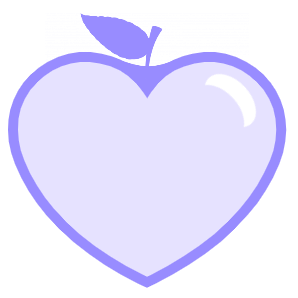

 <h3>Wholesome</h3> 
  

    <b>Languages</b>  
    
    
  
    
    

## Contents
- [Introduction](#introduction)
- [Documentation](#documentation)
- [Project Management Tools](#project-management-tools)
- [About Me](#about-me)
- [Connect with Me](#connect-with-me)

## Introduction
Wholesome is a system intended to assist individuals in tracking various health and fitness data with ease. By providing a way for users to easily log and analyse their health and fitness data, Wholesome aims to help users identify the patterns in their diet and workouts and encourage users to modify them to ensure a holistic, well-balanced lifestyle. The system also makes users more accountable for their choices and provides the means for them to make the necessary changes and motivate them to achieve their goals.

## Documentation
- User Manual: https://drive.google.com/file/d/1vM5dokxKnIq3eqW8B6LlIeGjSYU1RbPF/view?usp=sharing

## Project Management Tools
- ClickUp: https://sharing.clickup.com/b/h/4-3499625-2/1fe63d1349807cc
 
## About Me
- https://Vianka213.github.io
> I am a Computer Science Honours student at the University of Pretoria. I'm particularly interested in the fields of UI and UX design, as well as software development, cyber-security and digital forensics.
My greatest passion is learning. I love igniting my curiosity, thinking outside the box and experiencing new things.
I'm extremely ambitious, adaptable and a great problem-solver. My creativity and strong work ethic are amongst my strengths. I strive to utilise my abilities and skills to achieve my goals and help others to achieve theirs.

## Connect with Me
- LinkedIn: https://www.linkedin.com/in/vianka-naidoo-063305157/
- Email: u18278273@tuks.co.za 

